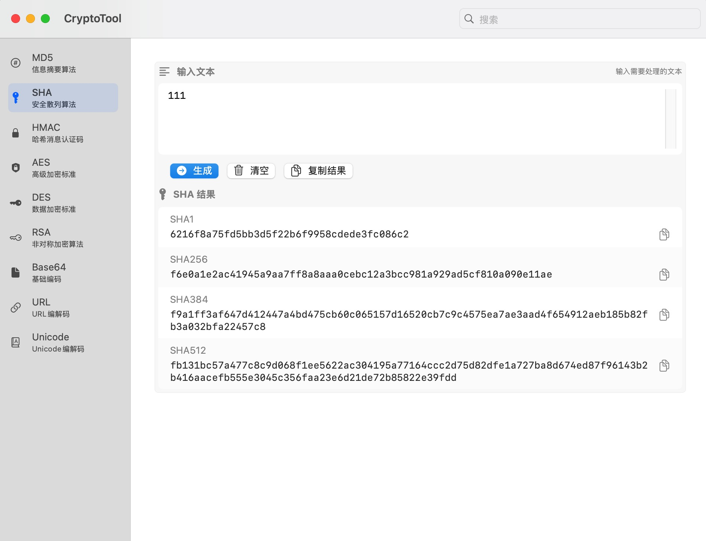
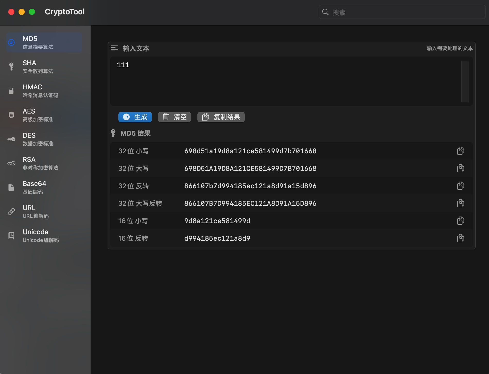

# CryptoTool - 加密工具箱

[](https://swift.org)
[](https://www.apple.com/macos)
[](LICENSE)

一个功能强大的 macOS 加密解密工具集合，提供直观的用户界面和丰富的加密算法支持。

## 📸 应用截图

<div align="center">
  
  
</div>

## ✨ 主要功能

### 🔐 加密算法
- **哈希函数**
  - MD5 (128位消息摘要)
  - SHA-1 (160位散列值)
  - SHA-256/384/512 (高强度散列)
  - HMAC (基于哈希的消息认证)

- **对称加密**
  - AES-128/192/256 (高级加密标准)
  - DES/3DES (数据加密标准)
  - 支持 ECB/CBC/CFB/OFB 加密模式
  - 支持 PKCS7/Zero/ANSI X.923 填充

- **非对称加密**
  - RSA 加密/解密/签名
  - 支持密钥长度 1024/2048/4096 位

### 🔄 编码工具
- Base16/32/64 编解码
- URL 编解码
- Unicode 编解码
- Hex 字符串转换

### 🛠 实用功能
- 实时加密/解密预览
- 批量文件处理
- 密钥生成器
- 结果导出(文本/文件)
- 深色模式支持

## 💻 系统要求

- macOS 13.0 (Ventura) 或更高版本
- 约 50MB 可用磁盘空间
- 64位 Intel 或 Apple Silicon 处理器

## 📦 安装方法

### 方法一：直接下载
1. 从 [Releases](https://github.com/yml2213/CryptoTool/releases) 页面下载最新版本
2. 解压下载的压缩包
3. 将 CryptoTool.app 拖入 Applications 文件夹

### 方法二：拷打作者,让他单发dmg

## 🚀 快速开始

1. 启动应用后，从左侧菜单选择所需工具
2. 在主界面输入待处理的文本或选择文件
3. 设置相关参数（如果有需要）:
   - 选择加密算法/模式
   - 设置密钥/IV
   - 选择输出格式
4. 点击执行按钮进行处理
5. 使用工具栏按钮复制或导出结果

## 🔨 开发相关

### 技术栈
- SwiftUI + Combine
- MVVM 架构设计
- Swift Package Manager 依赖管理
- XCTest 单元测试

### 本地开发
1. 克隆仓库
```bash
git clone https://github.com/yml2213/CryptoTool.git
```

2. 安装依赖
```bash
cd CryptoTool
swift package resolve
```

3. 使用 Xcode 打开项目
```bash
open CryptoTool.xcodeproj
```

## 🤝 参与贡献

1. Fork 本仓库
2. 创建特性分支 (`git checkout -b feature/AmazingFeature`)
3. 提交更改 (`git commit -m 'Add some AmazingFeature'`)
4. 推送到分支 (`git push origin feature/AmazingFeature`)
5. 提交 Pull Request

## 📄 许可证

本项目采用 MIT 许可证 - 详见 [LICENSE](LICENSE) 文件

## 📮 联系方式

- 问题反馈: [GitHub Issues](https://github.com/yml2213/CryptoTool/issues)
- 作者: [@yml2213](https://github.com/yml2213)
- 邮箱: a2213290201@gmail.com

## ⭐️ 支持项目

如果这个项目对你有帮助，欢迎给一个 star 支持一下！